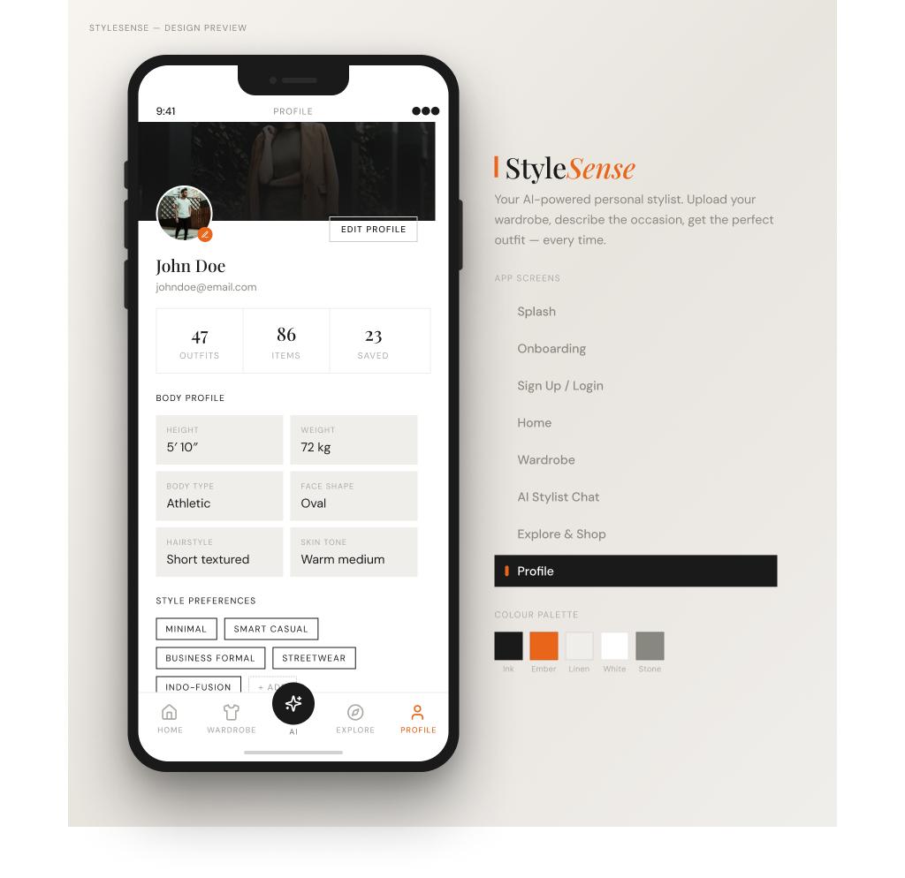

# 👗 StyleSense — AI Fashion Assistant

> *"Because People Respond to how we're dressed."\
>       &emsp;&emsp;&emsp;&emsp;&emsp;&emsp;&emsp;&emsp;&emsp;&emsp;&emsp;&emsp;- Harvey Specter*

**StyleSense** is a cross-platform mobile app that uses AI to recommend outfits from your own wardrobe based on the occasion, body type, and personal style. It also suggests new clothes from online stores like Myntra, Amazon, and Flipkart.

## UI Mockups
<p align="center">
  
  
  
  
  
  
  
  
  
  
  
  
</p>

## Tech Stack

| Layer | Technology |
|-------|-----------|
| **Frontend** | Expo SDK 56, React Native, NativeWind/TailwindCSS |
| **Backend** | Node.js, Express 5, TypeScript |
| **Database** | Supabase (PostgreSQL) |
| **AI** | Google Gemini 2.0 Flash (multimodal) |
| **Storage** | Supabase Storage (S3-compatible) |

## Getting Started

### Frontend (Expo)
```bash
npm install
npx expo start
```

### Backend (Express)
```bash
cd server
npm install
npm run dev
```

The API runs at `http://localhost:3001`. Check health: `GET /api/health`

## Project Structure

```
StyleSense/
├── src/app/          # Expo Router screens
├── src/components/   # Reusable UI components
├── constants/        # Theme & design tokens
├── server/
│   ├── src/
│   │   ├── routes/       # API endpoints
│   │   ├── services/     # AI, image processing
│   │   ├── middleware/   # Auth
│   │   ├── prompts/      # AI system prompts
│   │   └── validators/   # Request validation
│   └── supabase/
│       └── migrations/   # Database schema
└── assets/           # Images, icons
```

## License

MIT
