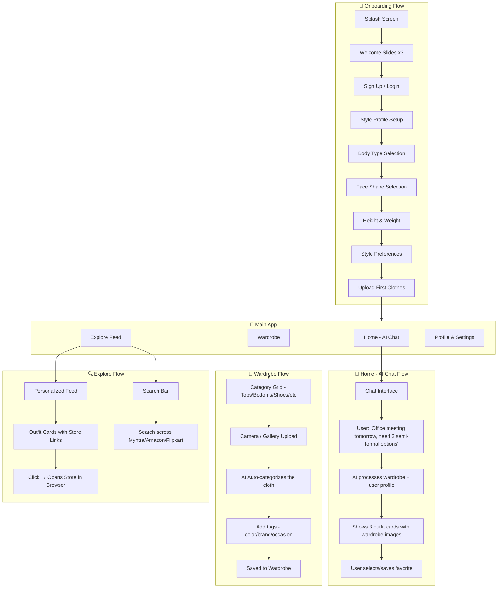
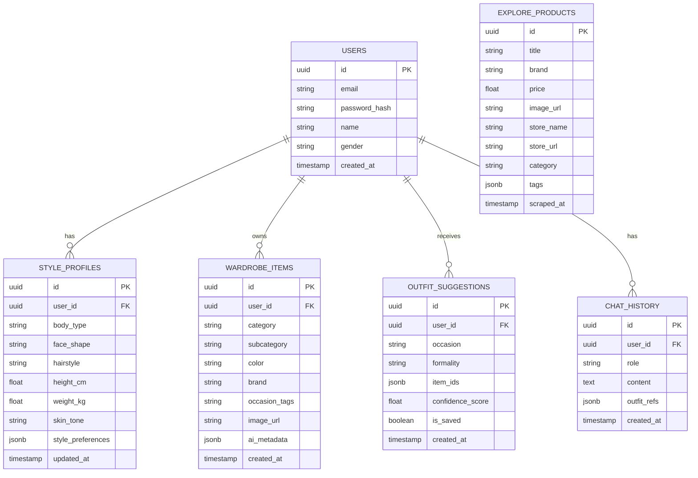
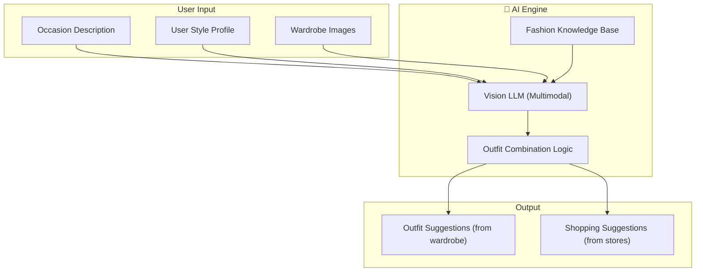
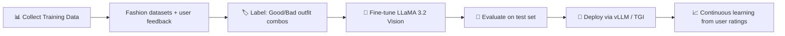
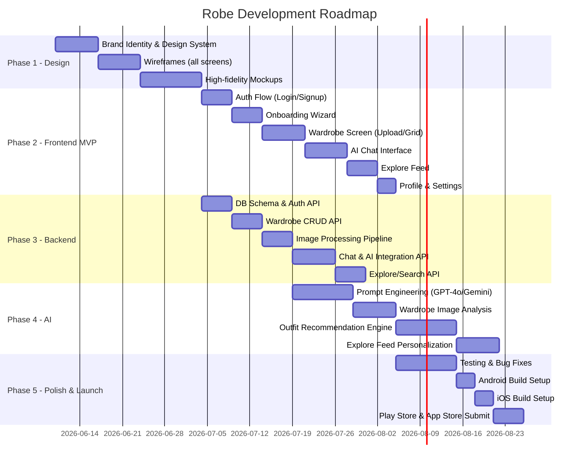

# 🧥 Robe — AI Fashion Assistant App

> *"Others judge you by how you dress. Dress smarter."*

**Robe** is a cross-platform mobile app that uses AI to recommend outfits from a user's own wardrobe based on the occasion, body type, and personal style. It also suggests new clothes from online stores like Myntra, Amazon, and Flipkart.

---

## 📋 Table of Contents

1. [Core Features](#1-core-features)
2. [Phase 1 — Design System & UI/UX](#2-phase-1--design-system--uiux)
3. [Phase 2 — Frontend (Expo/React Native)](#3-phase-2--frontend-exporeact-native)
4. [Phase 3 — Backend Architecture](#4-phase-3--backend-architecture)
5. [Phase 4 — AI/ML Pipeline](#5-phase-4--aiml-pipeline)
6. [Phase 5 — Third-Party APIs & Integrations](#6-phase-5--third-party-apis--integrations)
7. [Phase 6 — Development Timeline](#7-phase-6--development-timeline)
8. [Phase 7 — Testing, Deployment & Launch](#8-phase-7--testing-deployment--launch)
9. [Monetization Strategy](#9-monetization-strategy)
10. [Open Questions](#10-open-questions)

---

## 1. Core Features

### 📱 Main App Tabs

| Tab | Purpose |
|-----|---------|
| **Home** | AI Chatbot — describe occasion, get outfit suggestions from YOUR wardrobe |
| **Wardrobe** | Upload & manage your clothes (categorized: tops, bottoms, shoes, accessories, etc.) |
| **Explore** | AI-curated feed of outfit suggestions from online stores (Myntra, Amazon, Flipkart) |
| **Profile/Settings** | Body type, face shape, hairstyle, height, weight, style preferences |

### 🧠 AI Features
- **Outfit Recommender**: Given occasion + wardrobe → suggest complete outfit combinations as images
- **Style Profiler**: Analyze user's body type, face shape, skin tone → build a style profile
- **Explore Feed**: Recommend clothes from online stores that suit the user's profile
- **Search**: Find specific clothes/outfits across multiple online stores

---

## 2. Phase 1 — Design System & UI/UX

### 2.1 Brand Identity
```
Primary Colors:    Deep Charcoal (#1A1A2E) + Warm Gold (#D4A574)
Accent:            Soft Rose (#E8A0BF) for women / Steel Blue (#4A90D9) for men
Background:        Near-black (#0F0F1A) dark mode (default) / Cream (#FAF5F0) light mode
Typography:        "Outfit" (Google Font) — fitting for a fashion app
```

### 2.2 Screens to Design (Figma/Sketch)



### 2.3 Key UI Components to Design

| Component | Description |
|-----------|-------------|
| **Outfit Card** | Shows outfit image(s), occasion tag, match score |
| **Wardrobe Grid** | Pinterest-style masonry grid of clothing items |
| **Chat Bubble** | User message + AI response with embedded outfit images |
| **Style Profile Wizard** | Step-by-step body/style input with visual selectors |
| **Explore Card** | Product image + price + store badge + "View" CTA |
| **Category Chip** | Filterable tags (Formal, Casual, Party, etc.) |

### 2.4 Design Deliverables
- [ ] Figma/Sketch wireframes for all screens
- [ ] High-fidelity mockups with final colors/typography
- [ ] Component library / design system
- [ ] Micro-animation specs (screen transitions, card reveals, chat typing)
- [ ] App icon & splash screen design

---

## 3. Phase 2 — Frontend (Expo/React Native)

### 3.1 Tech Stack

| Technology | Purpose |
|------------|---------|
| **Expo SDK 56** | Cross-platform framework (Android + iOS + Web) |
| **expo-router** | File-based routing & navigation |
| **react-native-reanimated** | Smooth animations |
| **NativeWind / TailwindCSS** | Styling (already configured) |
| **expo-image** | Optimized image loading |
| **expo-camera** | Wardrobe photo capture |
| **expo-image-picker** | Gallery access |
| **react-native-gifted-chat** or custom | AI chat interface |
| **zustand** or **redux toolkit** | State management |
| **react-query / tanstack-query** | API data fetching & caching |
| **expo-secure-store** | Secure token storage |
| **expo-notifications** | Push notifications |

### 3.2 Screen / Route Architecture

```
src/app/
├── _layout.tsx                    # Root layout (auth check, theme provider)
├── (auth)/                        # Auth group (no tabs)
│   ├── _layout.tsx
│   ├── login.tsx
│   ├── signup.tsx
│   └── onboarding/
│       ├── welcome.tsx
│       ├── body-profile.tsx
│       └── style-preferences.tsx
├── (tabs)/                        # Main tab group
│   ├── _layout.tsx                # Tab bar configuration
│   ├── index.tsx                  # Home — AI Chat
│   ├── wardrobe/
│   │   ├── index.tsx              # Wardrobe grid
│   │   ├── [category].tsx         # Category view (tops, bottoms, etc.)
│   │   ├── add.tsx                # Add new item (camera/gallery)
│   │   └── [id].tsx               # Single item detail
│   ├── explore/
│   │   ├── index.tsx              # AI-curated feed
│   │   └── search.tsx             # Search across stores
│   └── profile/
│       ├── index.tsx              # Profile overview
│       ├── edit-profile.tsx       # Edit body/style info
│       └── settings.tsx           # App settings
├── outfit/
│   └── [id].tsx                   # Outfit detail view (from chat results)
└── product/
    └── [id].tsx                   # External product detail (Explore)
```

### 3.3 Key Frontend Tasks

- [ ] Set up authentication flow (login/signup screens)
- [ ] Build onboarding wizard (body type, face shape, preferences)
- [ ] Build AI chat interface with image-rich responses
- [ ] Build wardrobe management (CRUD, camera upload, categorization)
- [ ] Build explore feed (infinite scroll, product cards, filtering)
- [ ] Build search functionality across online stores
- [ ] Implement deep linking for outfit sharing
- [ ] Set up push notifications
- [ ] Polish animations & transitions

---

## 4. Phase 3 — Backend Architecture

### 4.1 Tech Stack Options

| Option A (Recommended) | Option B |
|------------------------|----------|
| **Node.js + Express/Fastify** | **Python (FastAPI)** |
| **PostgreSQL** (relational data) | Same |
| **Redis** (caching, sessions) | Same |
| **AWS S3 / Cloudflare R2** (image storage) | Same |
| **Firebase Auth** or **Supabase Auth** | Same |
| **Docker + Railway / Render** (hosting) | Same |

> [!TIP]
> **Option A (Node.js)** is recommended because your frontend is already JavaScript/TypeScript, so you stay in one language across the stack. **Option B (Python)** makes sense only if you want to tightly couple the AI inference server with the backend.

### 4.2 Database Schema (PostgreSQL)



### 4.3 API Endpoints

```
AUTH
├── POST   /api/auth/signup
├── POST   /api/auth/login
├── POST   /api/auth/refresh-token
├── POST   /api/auth/forgot-password
└── GET    /api/auth/me

USER PROFILE
├── GET    /api/profile
├── PUT    /api/profile
├── PUT    /api/profile/style          # Update body type, face shape, etc.
└── POST   /api/profile/avatar

WARDROBE
├── GET    /api/wardrobe               # List all items (with filters)
├── GET    /api/wardrobe/:id           # Single item
├── POST   /api/wardrobe               # Upload new item (image + metadata)
├── PUT    /api/wardrobe/:id           # Update item
├── DELETE /api/wardrobe/:id           # Remove item
└── GET    /api/wardrobe/categories    # Get category stats

AI CHAT
├── POST   /api/chat/message           # Send message, get AI outfit response
├── GET    /api/chat/history           # Get chat history
└── DELETE /api/chat/history           # Clear chat

OUTFIT SUGGESTIONS
├── GET    /api/outfits                # List saved outfits
├── POST   /api/outfits/save           # Save an outfit suggestion
├── DELETE /api/outfits/:id            # Remove saved outfit
└── POST   /api/outfits/generate       # Direct generation (non-chat)

EXPLORE
├── GET    /api/explore/feed           # Personalized product feed
├── GET    /api/explore/search         # Search across stores
├── GET    /api/explore/trending       # Trending items
└── GET    /api/explore/product/:id    # Product details
```

### 4.4 Image Processing Pipeline

```mermaid
flowchart LR
    A["📸 User uploads photo"] --> B["🔄 Backend receives image"]
    B --> C["📐 Resize & compress (Sharp.js)"]
    C --> D["☁️ Upload to S3/R2"]
    D --> E["🧠 Send to AI for analysis"]
    E --> F["🏷️ Auto-categorize (top/bottom/shoe)"]
    F --> G["🎨 Extract color, pattern, style"]
    G --> H["💾 Save metadata to DB"]
    H --> I["✅ Return to user"]
```



---

## 5. Phase 4 — AI/ML Pipeline

> [!IMPORTANT]
> This is the heart of the app. The AI needs to understand clothes visually, know fashion rules, and reason about outfit combinations.

### 5.1 AI Architecture Overview



### 5.2 Model Options (Pick ONE as base)

| Model | Pros | Cons | Cost |
|-------|------|------|------|
| **GPT-4o (OpenAI)** | Best multimodal, understands images well | Expensive at scale, no fine-tuning for vision | ~$5-15/1K requests |
| **Gemini 2.0 Flash (Google)** | Fast, good vision, cheaper | Slightly less fashion-specific | ~$1-3/1K requests |
| **Claude Sonnet 4 (Anthropic)** | Great reasoning | Limited fine-tuning options | ~$3-10/1K requests |
| **LLaMA 3.2 Vision (Meta)** | Free, fine-tunable, self-hosted | Need GPU infrastructure | Infra cost only |
| **Qwen2.5-VL (Alibaba)** | Open-source, good vision | Needs fine-tuning for fashion | Infra cost only |

> [!TIP]
> **Recommended approach**: Start with **Gemini 2.0 Flash** or **GPT-4o** API for the MVP (fastest to build). Then fine-tune an open-source model like **LLaMA 3.2 Vision** later to reduce costs at scale.

### 5.3 How the AI Outfit Recommendation Works

```
STEP 1 — WARDROBE ENCODING
   When user uploads a clothing item:
   → Vision model extracts: category, color, pattern, style, formality level, season
   → Store as structured metadata (JSON) alongside the image

STEP 2 — USER PROFILE CONTEXT
   Build a "fashion profile" prompt including:
   → Body type, face shape, height/weight, skin tone
   → Past outfit choices & ratings
   → Style preferences (minimal, streetwear, classic, etc.)

STEP 3 — OUTFIT GENERATION (Chat Request)
   User says: "I have a dinner date tonight, suggest 2 semi-formal outfits"
   
   System prompt includes:
   → Fashion styling rules (color theory, body-type-appropriate fits, occasion norms)
   → User's complete wardrobe metadata
   → User's style profile
   
   AI responds with:
   → 2 outfit combinations (referencing specific wardrobe item IDs)
   → Why each outfit works (color harmony, fit, occasion appropriateness)
   → Optional: "You're missing X, consider buying Y" → links to Explore

STEP 4 — IMAGE COMPOSITION
   → Retrieve the selected wardrobe item images
   → Display them as a styled outfit card (top + bottom + shoes + accessories)
```

### 5.4 Fine-Tuning Pipeline (Phase 2 — Post-MVP)



**Training Data Sources:**
- **Existing datasets**: DeepFashion, Fashion-MNIST (for classification), Polyvore Outfits (for compatibility)
- **Scraped data**: Outfit posts from Instagram, Pinterest (public fashion influencers)
- **User-generated**: Users rating outfit suggestions (thumbs up/down) → reinforcement signal
- **Expert curated**: Hire fashion stylists to create 500-1000 "gold standard" outfit combinations

### 5.5 Wardrobe Image Analysis (Computer Vision)

```
MODELS NEEDED:
├── Clothing Detection & Segmentation
│   └── Use: YOLO v8 / Segment Anything (SAM) to isolate clothing from background
├── Category Classification
│   └── Use: Fine-tuned ResNet/EfficientNet → top, bottom, shoe, accessory, outerwear
├── Attribute Extraction
│   └── Use: Vision LLM to extract → color, pattern (solid/striped/plaid), material, style
└── Background Removal
    └── Use: rembg (Python library) to create clean wardrobe thumbnails
```

---

## 6. Phase 5 — Third-Party APIs & Integrations

### 6.1 E-Commerce Store Integration

> [!WARNING]
> Myntra, Flipkart, and Amazon India **do not have official public product APIs**. You'll need to use one of these approaches:

| Approach | How it works | Legal Risk |
|----------|-------------|------------|
| **Affiliate Programs** ✅ | Join Amazon Associates, Flipkart Affiliate, etc. Get product data via affiliate APIs | None — fully legal |
| **Web Scraping** ⚠️ | Scrape product listings with Puppeteer/Playwright | Gray area — may violate ToS |
| **Third-party APIs** ✅ | Use aggregators like **RapidAPI** marketplace, **SerpAPI** for product search | Low risk — paid service |
| **Google Shopping API** ✅ | Search for products via Google Shopping results | Low risk |

> [!TIP]
> **Recommended**: Start with **Affiliate Programs** (Amazon Associates gives you a Product API) + **SerpAPI** for Google Shopping results that include Myntra/Flipkart. This is fully legal and you earn commissions on purchases!

### 6.2 Other Integrations

| Service | Purpose |
|---------|---------|
| **Firebase Auth** or **Supabase Auth** | User authentication (Google, Apple, Email) |
| **AWS S3 / Cloudflare R2** | Image storage for wardrobe photos |
| **Firebase Cloud Messaging** | Push notifications |
| **Sentry / BugSnag** | Error tracking |
| **PostHog / Mixpanel** | Analytics & user behavior |
| **RevenueCat** | Subscription management (if freemium) |
| **Stripe** | Payment processing (if needed) |

---

## 7. Phase 6 — Development Timeline



### Estimated Timeline: **~4-5 months** (solo developer) / **~2-3 months** (small team)

---

## 8. Phase 7 — Testing, Deployment & Launch

### 8.1 Testing
- **Unit Tests**: Jest for business logic
- **Component Tests**: React Native Testing Library
- **E2E Tests**: Detox (mobile) / Playwright (web)
- **AI Quality**: Track outfit suggestion accuracy with user feedback scores

### 8.2 Deployment

| Component | Platform |
|-----------|----------|
| **Mobile App** | EAS Build → Play Store (Android) + App Store (iOS) |
| **Backend API** | Railway / Render / AWS ECS |
| **Database** | Supabase (managed PostgreSQL) or AWS RDS |
| **Image Storage** | Cloudflare R2 (cheaper) or AWS S3 |
| **AI Inference** | OpenAI/Google API (MVP) → Self-hosted vLLM (scale) |
| **Web Version** | Vercel (Expo Web export) |

### 8.3 Launch Checklist
- [ ] App Store listing (screenshots, description, keywords)
- [ ] Privacy policy & terms of service
- [ ] Analytics & crash reporting setup
- [ ] Beta testing with 50-100 users
- [ ] Social media presence (Instagram, TikTok — fashion content)
- [ ] Landing page / website

---

## 9. Monetization Strategy

| Model | Description |
|-------|-------------|
| **Freemium** | Free: 5 outfit suggestions/day, 20 wardrobe items. Premium: Unlimited |
| **Affiliate Revenue** | Earn commission on every Explore purchase (Amazon: 1-10%, Flipkart: 2-12%) |
| **Sponsored Products** | Brands pay to appear in Explore feed (later stage) |
| **Premium Subscription** | ₹99-299/month for unlimited AI suggestions, advanced style analysis |

---

## 10. Open Questions

> [!IMPORTANT]
> **Decisions needed before we start coding:**

1. **Authentication**: Firebase Auth vs Supabase Auth vs custom? (Firebase is easier to start, Supabase gives you DB + Auth together)

2. **AI Model for MVP**: Start with GPT-4o API or Gemini 2.0 Flash? (Gemini is cheaper, GPT-4o may be slightly better at fashion understanding)

3. **Backend Language**: Node.js (same language as frontend) or Python (better AI/ML ecosystem)?

4. **Image Storage**: AWS S3, Cloudflare R2, or Supabase Storage?

5. **Design First?**: Do you want to design all screens in Figma first, or should we build UI directly in code with iterations?

6. **MVP Scope**: Should the first version include the Explore tab (requires store scraping/APIs), or focus only on Wardrobe + AI Chat?

7. **Budget**: What's your monthly budget for AI API calls and cloud hosting? This affects model choice significantly.

---

## Development Order (Recommended)

```
1️⃣  DESIGN          →  Figma mockups for all screens
2️⃣  AUTH + PROFILE   →  Login, signup, onboarding, style profile
3️⃣  WARDROBE         →  Upload, categorize, view clothes
4️⃣  AI CHAT          →  Connect LLM, outfit recommendations
5️⃣  EXPLORE          →  Product feed from online stores
6️⃣  POLISH           →  Animations, error handling, edge cases
7️⃣  TEST + DEPLOY    →  Beta test, then publish to stores
```

> Start answering the **Open Questions** above, and I'll begin building! 🚀
